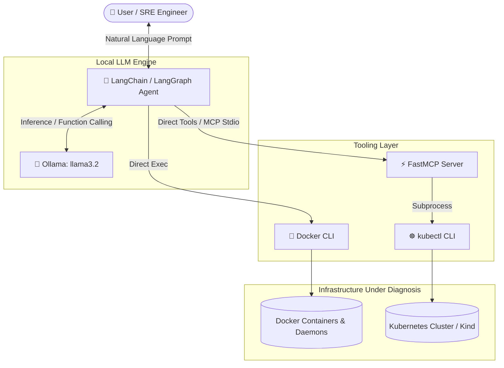

# 🤖 Agentic AI DevOps

[](https://www.python.org/)
[](https://www.langchain.com/)
[](https://ollama.com/)
[](https://github.com/jlowin/fastmcp)
[](https://www.docker.com/)
[](https://kubernetes.io/)

An autonomous, local LLM-powered **DevOps & SRE AI Agent** built using **LangChain**, **LangGraph**, **Ollama (`llama3.2`)**, and the **Model Context Protocol (MCP)**. It dynamically inspects, diagnoses, and troubleshoots infrastructure issues across Docker containers and Kubernetes clusters via natural language interaction.

---

## 📑 Table of Contents

- [Overview](#-overview)
- [Key Features](#-key-features)
- [Architecture](#-architecture)
- [Repository Structure](#-repository-structure)
- [Prerequisites](#-prerequisites)
- [Getting Started](#-getting-started)
  - [1. Clone Repository](#1-clone-repository)
  - [2. Virtual Environment Setup](#2-virtual-environment-setup)
  - [3. Install Dependencies](#3-install-dependencies)
  - [4. Setup Local LLM](#4-setup-local-llm)
  - [5. Verify Environment](#5-verify-environment)
- [Usage Guide](#-usage-guide)
  - [A. Standalone Multi-Tool ReAct Agent](#a-standalone-multi-tool-react-agent)
  - [B. FastMCP Modular Architecture Agent](#b-fastmcp-modular-architecture-agent)
- [Troubleshooting & Demo Scenario](#-troubleshooting--demo-scenario)
- [Available Agent Tools](#-available-agent-tools)
- [Contributing & License](#-contributing--license)

---

## 🚀 Overview

Modern cloud-native environments generate complex logs, events, and failure cascades. **Agentic AI DevOps** acts as your autonomous SRE assistant. It executes real CLI commands (`docker`, `kubectl`), parses runtime logs and events, correlates failure states (e.g., `CrashLoopBackOff`, container exit codes), and provides clear root-cause analysis and actionable remediations.

All models run **100% locally** via Ollama—ensuring zero data leakage and private cluster debugging.

---

## ✨ Key Features

- 🧠 **Local LLM-Driven ReAct Architecture**: Powered by `llama3.2` running offline with LangChain & LangGraph agents.
- 🔌 **Model Context Protocol (MCP) Compliant**: Implements modular, pluggable tools using `FastMCP` and `langchain-mcp-adapters` for seamless client-server integration.
- 🐳 **Docker Observability**: Real-time container discovery, state inspection, and log tailing.
- ☸️ **Kubernetes Diagnostics**: Pod lifecycle monitoring, detailed status inspection, and namespace event correlation.
- 💬 **Multi-Turn Conversation Memory**: Retains conversational context across diagnostic investigations.
- 🛠️ **Built-in Verification**: Self-checking diagnostic script (`verify.py`) to validate local toolchains.

---

## 🏛 Architecture



---

## 📂 Repository Structure

```text
Agentic-AI-Devops/
├── agent.py            # Standalone ReAct Agent with direct Docker & K8s tools
├── agent_with_mcp.py    # Async Agent interacting via Model Context Protocol (MCP)
├── mcp_server.py       # FastMCP Server exposing Kubernetes diagnostic tools
├── verify.py           # Pre-flight environment check (Docker, kubectl, Kind, Ollama)
├── broken_pod.yaml     # Chaos testing manifest (Simulates CrashLoopBackOff)
├── requirements.txt    # Python dependencies
└── .gitignore          # Environment and cache ignore rules
```

---

## ⚙️ Prerequisites

Ensure you have the following installed on your machine:

| Requirement | Minimum Version | Description |
| :--- | :--- | :--- |
| **Python** | `3.10+` | Core programming language |
| **Docker Desktop / Engine** | `20.10+` | Container runtime |
| **kubectl** | `v1.26+` | Kubernetes command-line tool |
| **Kind** / **Minikube** | Latest | Local Kubernetes cluster (Optional for local testing) |
| **Ollama** | Latest | Local LLM inference server |

---

## 📦 Getting Started

### 1. Clone Repository

```bash
git clone https://github.com/Vishva265/Agentic-AI-Devops.git
cd Agentic-AI-Devops
```

### 2. Virtual Environment Setup

```bash
# Create virtual environment
python -m venv .venv

# Activate on Windows (PowerShell):
.venv\Scripts\Activate.ps1

# Activate on Linux / macOS:
source .venv/bin/activate
```

### 3. Install Dependencies

```bash
pip install --upgrade pip
pip install -r requirements.txt
```

### 4. Setup Local LLM

Make sure Ollama is running and download the default model:

```bash
ollama run llama3.2
```

### 5. Verify Environment

Run the pre-flight verification script to ensure all requirements are satisfied:

```bash
python verify.py
```

*Example Output:*
```text
Checking your setup...

  [PASS] Python 3.10+
  [PASS] Docker
  [PASS] kubectl
  [PASS] Kind
  [PASS] Ollama + llama3.2
————————————————————————————————————————
  5/5 — you're ready!
```

---

## 🖥️ Usage Guide

### A. Standalone Multi-Tool ReAct Agent

Run the interactive CLI agent with embedded Docker and Kubernetes capabilities:

```bash
python agent.py
```

**Sample Prompts:**
- *"Check if any Docker containers have exited with a non-zero code."*
- *"Show me all pods running in the default namespace."*
- *"Inspect logs of container `<container_name>` and tell me why it failed."*

---

### B. FastMCP Modular Architecture Agent

Run the asynchronous agent integrated with the Model Context Protocol (MCP) server:

```bash
python agent_with_mcp.py
```

This starts a background `FastMCP` server (`mcp_server.py`) over stdio transport and binds its dynamic tool definitions directly into the LangChain reasoning loop.

---

## 🧪 Troubleshooting & Demo Scenario

Test the agent's ability to diagnose a failing Kubernetes workload using the included `broken_pod.yaml`:

1. **Deploy the failing pod:**
   ```bash
   kubectl apply -f broken_pod.yaml
   ```

2. **Launch the agent:**
   ```bash
   python agent.py
   ```

3. **Ask the agent to investigate:**
   ```text
   > Check if there are any unhealthy pods and explain what caused them to crash.
   ```

4. **Agent's autonomous response flow:**
   - 🔍 Calls `list_pods()` $\rightarrow$ identifies `broken-pod` in `Error` / `CrashLoopBackOff`.
   - 🔍 Calls `describe_pod(pod_name="broken-pod")` and `get_events()` $\rightarrow$ detects command termination `exit 1`.
   - 💡 Generates human-readable RCA and remediation suggestion.

5. **Clean up:**
   ```bash
   kubectl delete -f broken_pod.yaml
   ```

---

## 🧰 Available Agent Tools

| Tool Name | Domain | Description |
| :--- | :--- | :--- |
| `list_containers` | Docker | Lists all active and stopped Docker containers (`docker ps -a`) |
| `get_logs` | Docker | Retrieves the last 50 lines of logs for a target container |
| `inspect_container`| Docker | Fetches low-level configuration, network, and exit state JSON |
| `list_pods` | Kubernetes | Lists pods across namespaces with their operational status |
| `describe_pod` | Kubernetes | Extracts pod status conditions, container specs, and event history |
| `get_events` | Kubernetes | Fetches and chronologically sorts recent cluster namespace events |

---

## 🤝 Contributing & License

Contributions are welcome! Please feel free to submit a Pull Request or open an Issue for new tools, agent patterns, or multi-modal DevOps workflows.

Distributed under the [MIT License](LICENSE).
